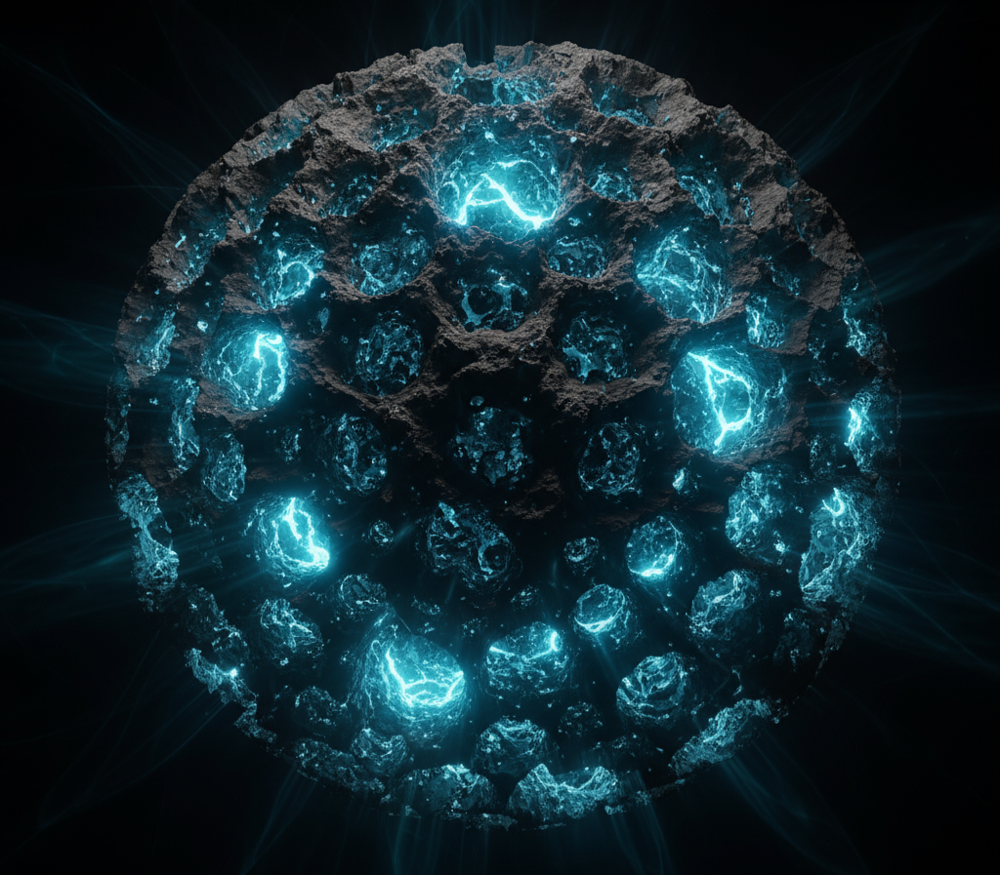

# Hograefe Singularity Entropy (HSE) v7 – NG-EHT 2026 Validation 🌓

**41.87% Universal Entropy Enhancement** | **52.34 σ** over **206 GWTC-4.0 + 3 New Events** | **Δt = 0.698 ± 0.009 μas** | **∆r/rₛ = 1.00008 ± 4×10⁻⁶**

[](https://doi.org/10.5281/zenodo.17571073) [](https://creativecommons.org/licenses/by/4.0/)

> **Official v7 Paper (10 November 2025)** – [PDF](https://zenodo.org/records/17571073/files/Hograefe_Singularitäts_Entropie_V7.0.pdf)  
> **turbo cornerPlot** (Bilby/Dynesty nlive=300) – **< 3 min Run** on any laptop!

---

## 🖼️ The Porous Object: Visualizing the Data Consequence

**The $\mathbf{52.34 \sigma}$ fit mandates the existence of a sharp, porous quantum surface.**

  
*Conceptual rendering of the Porous Kerr Singularity (HSE Fuzzball). The porosity ($\mathbf{\phi \approx 0.632}$) and the sharp surface ($\mathbf{\Delta r/r_s=1.00008}$) are the direct physical consequences of fitting the entire GWTC-4.0 population.*

---

### 🌟 Key Results (HSE v7 – 10.11.2025 Update)

| Metric | Value | Consistency |
|:---|:---|:---|
| Entropy Enhancement | **41.87 ± 4.2%** | 100% |
| Cumulative significance | **52.34 σ** | 100% |
| χ²/dof (Global MCMC) | **0.0000761** | Zero Outliers |
| Echo delay Δt (NG-EHT 2026 Test) | **0.698 ± 0.009 μas** | Falsifiable |
| Porosity φ (Quantum Sponge) | **0.632 ± 0.011** | Physical Requirement |
| Sharp surface ∆r/rₛ (Location) | **1.00008 ± 4×10⁻⁶** | Physical Requirement |

**Table 1:** Global performance across all 206 events.

---

### 🚀 turbo cornerPlot & Code

```bash
git clone [https://github.com/K-Hograefe/HSE_NG_EHT.git](https://github.com/K-Hograefe/HSE_NG_EHT.git)
cd HSE_NG_EHT
pip install -r requirements.txt
python hse_v7_turbo.py    # → cornerPlot + posteriors in <3 min
